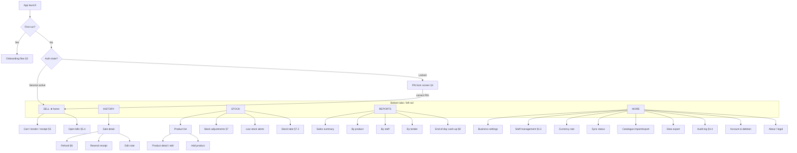
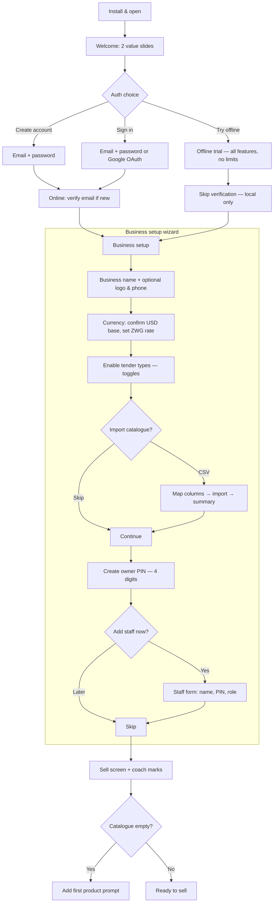
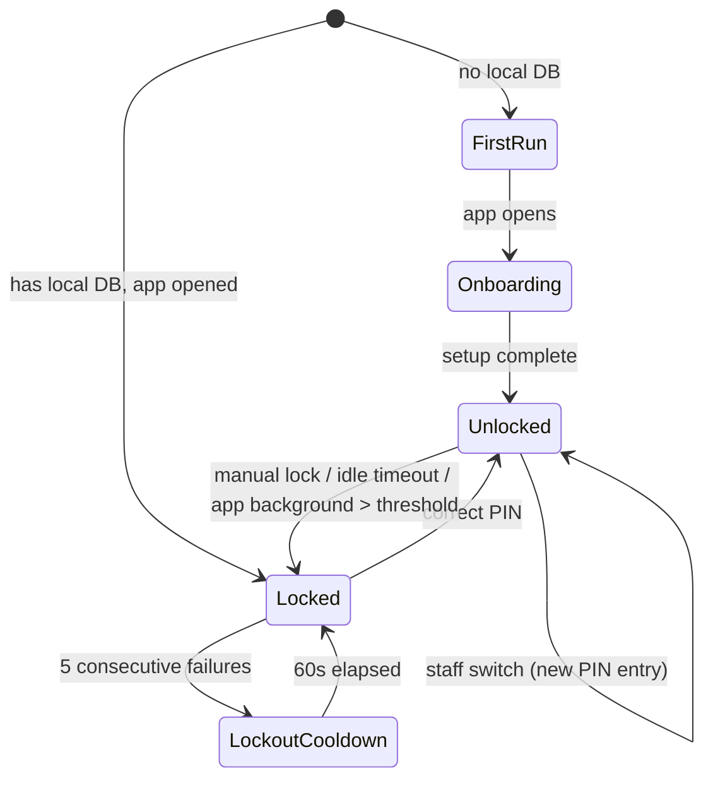
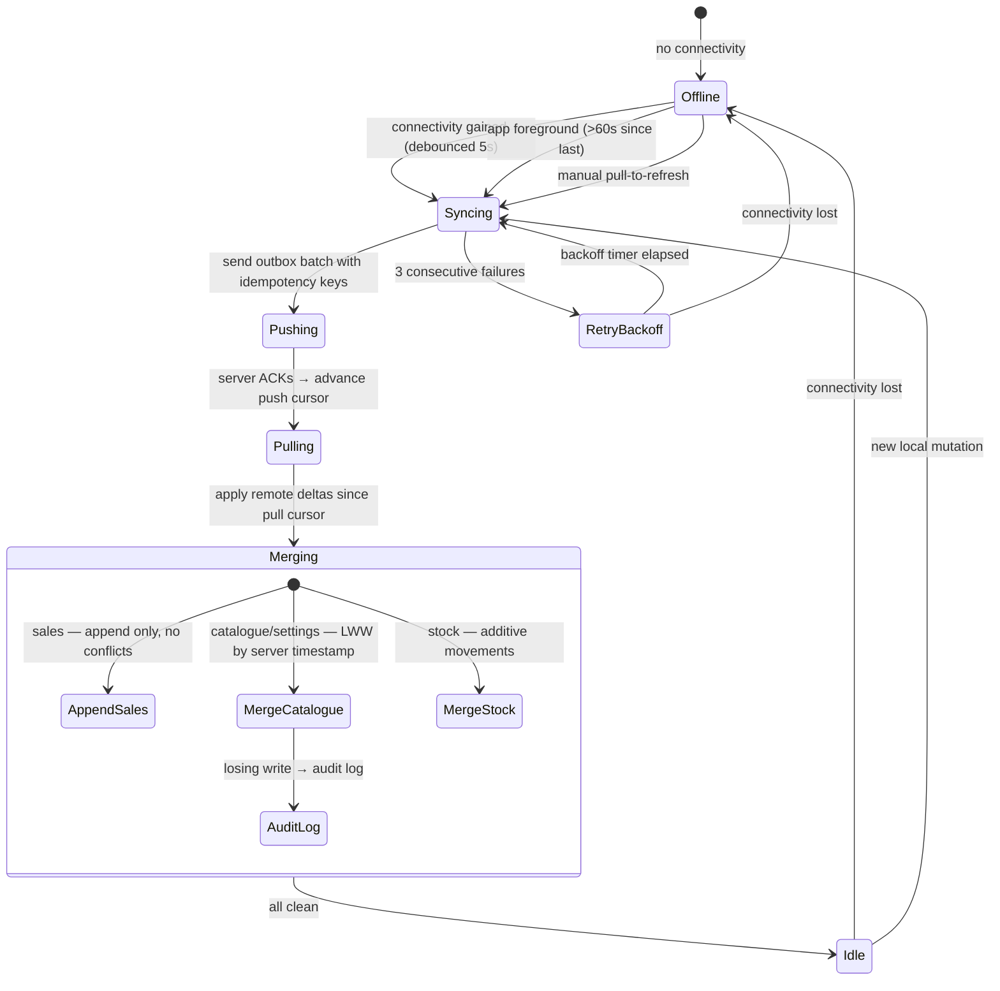

# UX & Application Flow — Tengesa POS
**Version:** 1.0 · **Owner:** MGX · **Status:** Gate 2 approved · **Phase:** 2 of 8

| Changelog | |
|---|---|
| v1.0 (Jul 2026) | Initial draft from v1 App Flow source material + approved PRD v2.1. Expanded to full Phase 2 coverage: user journeys, IA, all flowcharts, state/error/offline/sync/auth flows, screen inventory, tap-count audit. UX-architect review applied: 6 BLOCKERs fixed (device restore, trial migration, audit log, void=refund, tap-count honesty, opening float), 10 WARNINGs addressed |

**Source material:** `docs/archive/v1/02_APP_FLOW.md` — absorbed, expanded, and superseded by this document.

---

## 1. Information architecture

### 1.1 Navigation model

Yoco Counter pattern: **bottom tab bar** on phone (5 tabs), **left rail** on tablet (same 5 destinations). Sell is always home — cold start lands here after auth.



### 1.2 Tab definitions

| Tab | Icon | Badge | Primary job |
|---|---|---|---|
| **Sell** | Shopping bag | Open bills count | Ring up sales — tiles, keypad, cart, tender |
| **History** | Clock | — | Find, view, refund, reshare past sales |
| **Stock** | Package | Low-stock count | Manage catalogue, adjust stock, stock-take |
| **Reports** | Bar chart | — | Sales analytics, end-of-day cash-up, Z-report |
| **More** | Menu (≡) | Pending sync count | Settings, staff, rate, sync, import/export, account |

### 1.3 Tablet adaptations

On screens ≥ 768 dp width:
- Left rail replaces bottom tabs (always visible, icon + label)
- Sell screen: product grid fills left 60%, cart summary fixed on right 40%
- History: list on left, sale detail on right (master-detail)
- Stock: product list on left, product detail on right
- Reports: report selector on left, chart/data on right

- Tender screen: wider layout — USD and ZWG amounts side by side, tender type buttons in a 2×3 grid instead of stacked
- Cash-up: USD and ZWG pools side by side rather than stacked
- Refund: line selection list on left, summary on right

Phone uses single-column with push navigation for all detail screens.

---

## 2. User journeys (end-to-end scenarios)

### 2.1 Mai Tino — tuckshop morning rush (offline)

```
Power is off. Mai Tino opens Tengesa on her phone (airplane mode since last night).
1. App cold-starts to PIN screen (< 3s).
2. She enters her 4-digit PIN → lands on Sell tab.
3. Customer asks for 2 Mazoe + 1 bread. She taps tiles: Mazoe (tap qty "2"), Bread.
4. Taps "Charge" → Tender screen shows US$3.50 / ZWG 105.00.
5. Customer pays 200 ZWG cash. She taps "Cash ZWG", enters 200.
6. Screen shows change: 95.00 ZWG. She taps "Done".
7. Sale commits (< 150ms). Receipt screen offers "Share" — she skips.
8. Back to Sell. Total elapsed: ~10 seconds, 6 taps.
9. Sync badge shows "1 pending". When power returns, it syncs silently.
```

### 2.2 Kuda — boutique refund with supervisor gate

```
Kuda's cashier Tino needs to refund a customer's dress (wrong size).
1. Tino taps History tab → searches by receipt number.
2. Taps the sale → Sale detail screen shows items, tender, timeline.
3. Taps "Refund" → System detects Tino is cashier → Supervisor PIN prompt.
4. Kuda enters his supervisor PIN → prompt clears.
5. Tino selects the dress line, chooses "Partial refund".
6. Reason dropdown: "Wrong size" (mandatory). Restock toggle: ON.
7. Taps "Confirm Refund" → Refund record created with Kuda's staff_id.
8. Stock movement: +1 dress (refund-restock), linked to refund.
9. Refund receipt available to share. Original sale shows "Partially refunded" badge.
```

### 2.3 Rufaro — remote owner checking end-of-day

```
Rufaro is at home. Her salon cashier calls to say the day is done.
1. Rufaro opens app → PIN → Reports tab → End of day.
2. Selects today. System shows per-currency expected:
   - USD: float $20 + sales $145.50 - refunds $5.00 - payouts $10.00 = $150.50
   - ZWG: float ZWG 0 + sales ZWG 3,000 - refunds ZWG 0 = ZWG 3,000
3. Cashier counts and tells Rufaro the drawer: USD $148.50, ZWG 3,000.
4. Rufaro enters counts. USD variance: -$2.00 → mandatory note ("short").
5. ZWG balanced. Taps "Complete".
6. Z-report generated as image. Rufaro shares to WhatsApp group.
```

### 2.4 Tatenda — takeaway with parked bills

```
Tatenda is running the lunch rush. A phone order comes in while a walk-in is mid-order.
1. Walk-in's cart has 2 items. Tatenda taps "Save bill", names it "Counter 1".
2. Sell screen clears. He rings up the phone order (3 items), charges → done.
3. Taps the "Open bills" badge on Sell tab → sees "Counter 1".
4. Taps to resume → cart restored. Adds 1 more item, charges, done.
5. Both sales attributed to Tatenda (his PIN session).
```

### 2.5 New owner — first-time onboarding

```
A new owner installs from Play Store. Has no internet right now.
1. Welcome screen: "Tengesa — sell smarter" with 2 value slides.
2. "Create account" / "Sign in" / "Try offline first" buttons.
3. Owner taps "Try offline first" → proceeds to setup without account.
4. Business name: "Tino's Tuckshop". Logo: skip. Phone: skip.
5. Currency: USD base rate confirmed. ZWG rate: enters 30.00.
6. Tender types: cash_usd ✓, cash_zwg ✓, ecocash ✓ (others off).
7. Import catalogue: skip (will add products manually).
8. Create owner PIN: 1234 (system warns if too simple, allows it).
9. Add staff: "Later".
10. Lands on Sell screen. Coach marks: "Tap a tile to add", "Swipe to cart",
    "Tap Charge when ready". Sell tab is empty — prompts "Add your first product".
11. Taps "+" → Product form: name "Mazoe", price $1.50, category "Drinks".
12. Product tile appears. Owner is selling within 5 minutes.
```

---

## 3. Onboarding flow



### 3.1 Onboarding rules

- **Trial mode:** full feature access, no time limit, no transaction cap. Data persists locally and migrates into the account on registration. Sync badge shows "Account needed to sync" instead of pending count.
- **Wizard is skippable:** each step has reasonable defaults (USD, all tenders on, empty catalogue). The owner can change everything later in Settings.
- **Coach marks:** shown once per account. Dismissible individually. Stored as a local flag. Four marks: "Tap a tile to add", "Swipe to see your cart", "Tap Charge when ready", "Prices in USD. ZWG shows at your rate."
- **Target:** install → first sale in ≤ 10 minutes (NFR-8).

---

## 4. Authentication & staff flows

### 4.1 Auth state machine



### 4.2 Staff management

| Action | Required role | Screen |
|---|---|---|
| Add staff | Admin | More → Staff management → Add |
| Edit staff (name, PIN, role) | Admin | More → Staff management → Edit |
| Deactivate staff | Admin | More → Staff management → toggle |
| Switch active user | Any (own PIN) | Lock screen or lock icon |

**PIN rules:**
- 4 digits, unique within the merchant account (rejects duplicates)
- 5 consecutive failures → 60-second lockout for that staff member
- Auto-lock after configurable idle (default 5 minutes, range 1–60, admin-settable)
- Lock returns to PIN entry screen (shows staff name + generated initials avatar for quick selection)
- "Simple PIN" warning triggers for sequential (1234, 4321) or repeated (1111, 0000) patterns — warning only, not blocked

### 4.3 Permission matrix (FR-A3)

| Capability | Cashier | Supervisor | Admin |
|---|---|---|---|
| Sell (ring up, tender, receipt) | ✓ | ✓ | ✓ |
| View own sales | ✓ | ✓ | ✓ |
| View all sales / history | — | ✓ | ✓ |
| View stock levels | ✓ | ✓ | ✓ |
| Refund (full or partial) | — | ✓ | ✓ |
| Discount > threshold % | — | ✓ | ✓ |
| Void sale (= full refund, same flow §6) | — | ✓ | ✓ |
| Stock adjustment | — | ✓ | ✓ |
| Stock-take | — | ✓ | ✓ |
| Price edit | — | — | ✓ |
| Reports access | — | — | ✓ |
| Staff management | — | — | ✓ |
| Business settings | — | — | ✓ |
| Rate changes | — | — | ✓ |
| Data export / import | — | — | ✓ |

Enforced in the data/repository layer, mirrored in UI (hidden or disabled actions). Permission customisation screen available under More → Business settings (admin only) — allows toggling individual capabilities per role.

### 4.4 Audit log (FR-I2)

Accessible via More → Audit log (admin only). Chronological list of auditable events, filterable by event type.

**Auditable events:** refunds, discounts > threshold, price changes, stock adjustments, rate changes, staff changes (add/edit/deactivate), void sales.

**Each entry displays:** event type icon, description (e.g. "Price changed: Mazoe $1.50 → $1.75"), staff name, device name, timestamp. Tap to expand shows old value, new value, and linked entity (e.g. the product or sale).

Audit log is append-only, synced. Entries cannot be edited or deleted by any role.

### 4.5 Device registration & restore (FR-H4)

```mermaid
flowchart TD
    A[Sign in on new/replacement device] --> B{Server has merchant data?}
    B -->|Yes| C[Restore prompt: "Found your business data. Restore?"]
    B -->|No| D[Normal onboarding — fresh setup]
    C -->|Restore| E[Download progress: products, staff, settings, sales history]
    E --> F{Download complete?}
    F -->|Yes| G[PIN lock — existing staff PINs active]
    F -->|Error| H["Restore incomplete. Retry?" — partial data preserved]
    C -->|Skip| D
    G --> I[Sell screen — fully operational]
    H -->|Retry| E
    H -->|Continue with partial| G
```

**Restore rules:**
- Triggered when a signed-in account has existing cloud data but the device has no local DB
- Downloads all synced data: products, categories, staff, settings, rate, sales history, stock movements
- Unsynced data from a lost/destroyed device is unrecoverable — restore screen displays the last-sync timestamp of the previous device so the owner can assess potential data loss
- Device is registered with the merchant account on first successful sync (device ID + name stored server-side)
- Multiple devices are supported (FR-H3 multi-device)

### 4.6 Trial-to-account conversion (FR-A1)

```mermaid
flowchart TD
    A[Trial mode: More → "Create Account"] --> B[Email + password form]
    B --> C{Online?}
    C -->|Yes| D[Create account on server]
    C -->|No| E["You need internet to create an account. Your data is safe locally."]
    D --> F[Migrate: associate all local data with new account]
    F --> G[Progress indicator: "Setting up your account..."]
    G --> H{Success?}
    H -->|Yes| I[Toast: "Account created! Your data will now sync."]
    H -->|Error| J["Account created but sync failed. Will retry automatically."]
    I & J --> K[Return to previous screen — trial badge removed]
```

**Migration rules:**
- All trial data (products, sales, stock, settings, staff) is preserved and associated with the new account
- No data is deleted or reset during migration
- Sync begins immediately after successful account creation
- If the user already has account data from another device, a merge prompt appears (same as device restore flow)

---

## 5. Core sell flow

### 5.1 Sell screen → Cart → Tender → Receipt

```mermaid
flowchart TD
    A[SELL screen] --> B{Input mode}
    B -->|Catalogue| C[Tap product tile]
    B -->|Quick amount| D[Keypad: enter amount + optional label]
    B -->|Barcode scan — Should| BS[Camera scan → match product]

    C --> C1{Has variants?}
    C1 -->|Yes| C2[Variant picker bottom sheet]
    C1 -->|No| C3[Add to cart qty=1]
    C2 --> C3
    BS --> C3
    D --> C3

    C3 --> CART[Cart review]

    subgraph CART_OPS[Cart operations]
        CART --> CO1[Adjust qty +/−]
        CART --> CO2[Line discount — value or %]
        CART --> CO3[Bill discount — value or %]
        CART --> CO4[Add sales note]
        CART --> CO5[Remove item]
    end

    CART --> E{Action}
    E -->|Save bill| SB[Name prompt → saved to local DB]
    SB --> A
    E -->|Charge| F[Tender screen]

    subgraph TENDER[Tender screen]
        F --> F1[Display: total USD + ZWG equivalent]
        F1 --> F2[Select tender type]
        F2 --> F3[Enter amount received]
        F3 --> F4[Change calculated in tendered currency]
        F4 --> F5{Cashier toggles change currency?}
        F5 -->|Yes| F6[Recalculate in other currency]
        F5 -->|No| F7[Continue]
    end

    F6 & F7 --> G[Tap "Done" — atomic commit]
    G --> H[Receipt screen]
    H --> H1[Share via Android share sheet]
    H --> H2[Skip — new sale]
    H1 --> H2
```

### 5.2 Tap-count audit (FR-C5: ≤ 6 taps from sell screen)

**Simple product, exact amount (best case):**

| Step | Tap | Running total |
|---|---|---|
| Tap product tile | 1 | 1 |
| Tap "Charge" | 2 | 2 |
| Tap tender type (e.g. "Cash USD") | 3 | 3 |
| Tap "Done" (exact amount) | 4 | 4 |

**Variant product, custom amount received (worst case within target):**

| Step | Tap | Running total |
|---|---|---|
| Tap product tile | 1 | 1 |
| Select variant in bottom sheet | 2 | 2 |
| Tap "Charge" | 3 | 3 |
| Tap tender type | 4 | 4 |
| Confirm custom received amount | 5 | 5 |
| Tap "Done" | 6 | 6 |

**Summary:** 4 taps best case (simple product, exact amount). 6 taps worst case (variant + custom amount). Adding receipt share is +1 in both cases (5 or 7). The ≤ 6 target holds for the sale itself; receipt sharing is a post-sale action not counted.

### 5.3 Dual-currency display rules

- Sell screen tiles: **USD price primary**, ZWG secondary (smaller, blue)
- Cart: all line items in USD; subtotal/discount/total in USD with ZWG equivalent below
- Tender screen: total shown as "US$X.XX / ZWG Y.YY" side by side
- Change: shown in tendered currency by default; toggle available to see other currency
- Receipt: both USD total and ZWG equivalent printed; `fx_rate_used` displayed

### 5.4 Open/saved bills

- Bills saved to local SQLite with a merchant-given name (e.g. "Table 3", "Phone order")
- No hard limit on concurrent saved bills
- Survive app kill, restart, device reboot
- Sell tab badge shows count of open bills
- Resuming a bill restores the full cart state
- Device-local until completed as a sale (then synced via outbox)
- Open bills do NOT appear in history or reports until completed

---

## 6. Refund flow

```mermaid
flowchart TD
    A[History tab → find sale] --> B[Sale detail screen]
    B --> C[Tap "Refund"]
    C --> D{Current user role}
    D -->|Cashier| E[Supervisor PIN prompt]
    D -->|Supervisor+| F[Proceed]
    E -->|Cashier PIN entered| E1[Reject — "Supervisor PIN required"]
    E -->|Supervisor PIN entered| F
    E -->|Cancel| B

    F --> G{Refund type}
    G -->|Full| G1[All lines selected]
    G -->|Partial| G2[Select lines + quantities]

    G1 & G2 --> H[Reason — mandatory dropdown]
    H --> I{Restock?}
    I -->|Per line toggle| I1[Generates refund-restock movement per line]
    I --> J[Review summary: lines, amounts, restock status]
    J --> K[Tap "Confirm Refund"]
    K --> L[Atomic commit: refund record + stock movements + outbox]
    L --> M[Refund receipt — shareable]
    M --> N[Original sale shows "Refunded" / "Partially refunded" badge]
```

### 6.1 Refund rules

- Refund record stores the **supervisor's** `staff_id` who authorised it, not the cashier who initiated
- Immutably linked to the original sale (sale_id FK)
- Reflected as negative revenue in all reports
- Each refunded line may independently toggle restock on/off
- Restock generates a `refund-restock` stock movement in the same atomic transaction
- A sale can be partially refunded multiple times until fully refunded
- Cannot refund more than the original quantity per line

### 6.2 Edit sale note (FR-F3)

From sale detail screen: tap the note area → inline edit field appears. Any role can edit. The change is recorded in the audit log (old note, new note, staff, timestamp). Available for both synced and unsynced sales.

### 6.3 Resend receipt (FR-F3)

From sale detail screen: tap "Share receipt" → receipt image is regenerated using the original sale data (including original `fx_rate_used`, not current rate) → Android share sheet opens. Works offline.

### 6.4 Discount entry flow (FR-C2)

From cart: tap discount icon on a line item (line discount) or on the subtotal bar (bill discount) → bottom sheet opens:
1. Toggle: "Value" or "Percentage"
2. Keypad: enter amount (USD cents) or percentage
3. If percentage discount and resulting amount exceeds threshold: supervisor PIN prompt triggers (per FR-A3)
4. Tap "Apply" → discount reflected in cart totals immediately
5. Line discounts apply first, then bill discount applies to the resulting subtotal

### 6.5 Refund reason codes

Standard set (merchant cannot customise in R1):
- Wrong item
- Wrong size/variant
- Defective/damaged
- Customer changed mind
- Overcharge
- Other (free-text required)

---

## 7. Stock management flows

### 7.1 Stock adjustment

```mermaid
flowchart TD
    A[Stock tab → product] --> B[Tap "Adjust stock"]
    B --> C{Adjustment type}
    C -->|Received| D1[Enter +qty — e.g. delivery]
    C -->|Damaged / expired| D2[Enter −qty]
    C -->|Count correction| D3[Enter counted qty → system calculates delta]

    D1 & D2 & D3 --> E[Reason + optional note]
    E --> F{Role check}
    F -->|Cashier| F1[Rejected — supervisor+ required]
    F -->|Supervisor+| G[Confirm]
    G --> H[Append movement record — type, qty_delta, reason, staff_id, timestamp]
    H --> I[New on-hand = SUM of all movements]
    I --> J[Outbox row queued]
```

### 7.2 Stock-take flow (Should)

```mermaid
flowchart TD
    A[Stock tab → "Stock-take"] --> B{Role check}
    B -->|Below supervisor| B1[Rejected]
    B -->|Supervisor+| C[System lists all active products with current on-hand]
    C --> D[For each product: enter counted quantity]
    D --> E{Counted ≠ on-hand?}
    E -->|Yes| F[System calculates delta — shows variance]
    E -->|No| G[Mark as confirmed — no movement needed]
    F --> H[Review variances]
    H --> I[Confirm — generates count_correction movements]
    I --> J[Each correction: qty_delta = counted − derived_on_hand at commit time]
    J --> K[Warning if on-hand changed since count was entered]
```

### 7.3 Stock rules

- On-hand is **always derived**: `SUM(qty_delta)` across all movements for a product
- Movement types: `opening`, `sale` (negative), `refund-restock` (positive), `received`, `damaged`, `count_correction`
- Multiple `opening` movements permitted (e.g. batch arrivals before first sale)
- Every movement stores: `product_id`, `variant_id` (if applicable), `qty_delta`, `type`, `reason`, `staff_id`, `device_id`, `created_at`
- Low-stock threshold per product; badge on Stock tab; dedicated low-stock list view
- Soft-deleted products: excluded from sell screen and catalogue; remain in history and reports for periods when active; restorable by admin; not shown in low-stock alerts

---

## 8. End-of-day cash-up flow

```mermaid
flowchart TD
    A[Reports tab → "End of day"] --> B[Select business date — default today]
    B --> C[System calculates per currency pool]

    subgraph USD_POOL[USD cash pool]
        C --> U1["Opening float (entered at start or carried)"]
        U1 --> U2["+ Cash USD sales"]
        U2 --> U3["− Cash USD refunds"]
        U3 --> U4["− Paid-out (USD)"]
        U4 --> U5["+ Paid-in (USD) — when FR-G4 ships"]
        U5 --> U6["= Expected USD"]
    end

    subgraph ZWG_POOL[ZWG cash pool]
        C --> Z1["Opening float ZWG"]
        Z1 --> Z2["+ Cash ZWG sales"]
        Z2 --> Z3["− Cash ZWG refunds"]
        Z3 --> Z4["− Paid-out (ZWG)"]
        Z4 --> Z5["+ Paid-in (ZWG) — when FR-G4 ships"]
        Z5 --> Z6["= Expected ZWG"]
    end

    U6 & Z6 --> D[Enter counted cash per currency]
    D --> E{Any variance?}
    E -->|Yes| F[Variance displayed — mandatory note per currency with variance]
    E -->|No| G[Balanced]
    F & G --> H[Tap "Complete"]
    H --> I[Z-report generated as image]

    subgraph ZREPORT[Z-report contents]
        I --> I1[Business name + date + staff who closed]
        I1 --> I2[Totals by tender type]
        I2 --> I3[Totals by staff member]
        I3 --> I4[Totals by category]
        I4 --> I5[Cash pool summaries: expected vs counted vs variance]
        I5 --> I6[Receipt footer]
    end

    I --> J[Share via Android share sheet — WhatsApp, SMS, etc.]
```

### 8.1 Opening float entry

The cash-up screen includes an "Opening float" field per currency at the top. Flow:

1. When starting cash-up for a date with no previous close, the float fields are empty (default $0 / ZWG 0) — the merchant enters what they put in the drawer at start of day.
2. If a previous day's cash-up exists, the float is pre-filled with the previous day's counted amount (carry-forward). Editable.
3. Float entry is part of the cash-up screen itself — no separate "start of day" flow required.

### 8.2 Cash-up rules

- Runs independently per physical cash pool (USD and ZWG) per FR-G2
- Cross-currency tenders affect only the pool of the currency actually received
- Opening float: entered at top of cash-up screen; pre-filled from previous close if available
- R1 formula per pool: opening_float + cash_sales − cash_refunds = expected (paid-in/paid-out added when FR-G4 ships)
- Variance requires a mandatory note per currency that's short/over
- Z-report is a shareable image (not a live screen) — timestamped, immutable after generation
- All data sourced from local DB — works fully offline

---

## 9. Offline & sync UX

### 9.1 Sync state machine



### 9.2 Sync status UI

| Location | Display |
|---|---|
| More tab badge | Pending outbox count (e.g. "12") |
| More → Sync status screen | Last synced timestamp, pending count, current state (idle/syncing/error), retry countdown if backing off, manual "Sync now" button |
| Trial mode (no account) | Badge shows "Account needed to sync" instead of count |
| Global toast | Brief toast on successful sync batch ("12 items synced") |

### 9.3 Conflict resolution UX

Conflicts are resolved automatically — no user intervention needed in R1:

| Data type | Resolution | User visibility |
|---|---|---|
| Sales | Append-only — no conflicts possible | — |
| Stock movements | Additive merge (SUM of all qty_delta) — order-independent | — |
| Catalogue/settings | LWW by server-received timestamp | Toast: "Product X was updated on another device" |
| Rate changes | LWW by server-received timestamp | Toast: "Rate updated to X on another device" |

Losing writes are preserved in the audit log (viewable by admin in More → Audit log, §4.4).

---

## 10. Error & edge-case flows

### 10.1 Error handling principles

1. **Never block selling.** Any error that is not directly related to the current sale must be non-blocking (toast, badge, log).
2. **Offline is not an error.** No "no internet" modals, warnings, or degraded states for any feature.
3. **Local failures are critical.** SQLite write failure = show error + prevent sale completion + log to Sentry. This should be exceptionally rare.
4. **Sync failures are recoverable.** Retry with backoff. Never lose local data due to a sync error.
5. **User errors get confirmation, not prevention.** "Are you sure?" for destructive actions (refund, delete product); never for adding/selling.

### 10.2 Error scenarios

| Scenario | Behaviour |
|---|---|
| **Sale commit fails** (SQLite error) | Error dialog: "Sale could not be saved. Please try again." Cart is preserved. Log to Sentry. |
| **PIN lockout** | "Too many attempts. Try again in 60 seconds." Countdown visible. Other staff can still log in. |
| **Sync push fails** | Retry with exponential backoff (3 failures → wait). Badge stays. Toast on eventual success. |
| **Sync pull conflict** | Auto-resolved (see §9.3). Toast notification for catalogue changes. |
| **CSV import: bad rows** | Import what's valid; show summary: "142 imported, 8 skipped (see details)". Skipped rows downloadable as CSV. |
| **Product not found (barcode scan)** | "No product found. Add it?" → pre-fill barcode in product form. |
| **Rate not set** | First sale blocked: "Set your ZWG rate in Settings before selling." Links to rate screen. |
| **Discount exceeds threshold** | Supervisor PIN prompt (per FR-A3). Cashier PINs rejected. |
| **Refund exceeds original** | "Cannot refund more than original quantity." Line qty capped. |
| **Stock-take: on-hand changed** | Warning: "Stock changed since your count (sale occurred). Current on-hand is X. Adjust your count?" |
| **Device storage full** | Warning on app start: "Storage low. Sync your data and free space." Selling continues until SQLite literally cannot write. |
| **App killed mid-sale** | Cart state recovered from local storage on restart (per NFR-2). |
| **Force quit during sync** | Outbox rows intact. Sync resumes on next trigger. Idempotency keys prevent duplicates. |

---

## 11. Screen inventory

### 11.1 Complete screen list

| # | Screen | Tab/Flow | Notes |
|---|---|---|---|
| 1 | Welcome / value slides (×2) | Onboarding | First run only |
| 2 | Auth: create account / sign in | Onboarding | Email+password, Google OAuth, offline trial |
| 3 | Business setup wizard | Onboarding | Name, logo, currency, tenders, import, PIN, staff |
| 4 | PIN lock | Auth | Staff avatars + keypad |
| 5 | Sell — catalogue view | Sell tab | Tiles + category chips |
| 6 | Sell — keypad view | Sell tab | Quick-amount entry |
| 7 | Variant picker | Sell (bottom sheet) | Size/colour selection |
| 8 | Cart review | Sell tab | Line items, discounts, notes |
| 9 | Tender | Sell flow | Dual-currency total, tender type, amount received, change |
| 10 | Receipt | Sell flow | Branded, receipt number, share option |
| 11 | Open bills list | Sell tab | Named saved bills |
| 12 | History list | History tab | Search, filter, sale cards |
| 13 | Sale detail | History flow | Full sale info + timeline |
| 14 | Refund | History flow | Line selection, reason, restock toggle |
| 15 | Refund receipt | History flow | Shareable refund confirmation |
| 16 | Product list | Stock tab | Grid/list toggle, search, filter |
| 17 | Product detail / edit | Stock flow | Fields per FR-B1: name, image (camera/gallery), category, brand, cost price (USD cents), selling price (USD cents), barcode, SKU, active flag, variants. Cost price required for gross margin reports |
| 18 | Add product | Stock flow | Same form as edit, empty |
| 18a | Category management | Stock flow | List, add, edit, delete, drag-to-reorder categories (FR-B2) |
| 19 | Stock adjustment | Stock flow | Type, qty, reason |
| 20 | Stock-take | Stock flow | Guided count (Should) |
| 21 | Low-stock list | Stock tab | Filtered view, threshold badges |
| 22 | Reports home | Reports tab | Period selector (today/week/month/custom); summary cards: total revenue, sale count, average sale value, gross margin (FR-G1) |
| 23 | Report: by product | Reports flow | Revenue/qty by product |
| 24 | Report: by staff | Reports flow | Revenue/count by staff |
| 25 | Report: by tender | Reports flow | Revenue by tender type |
| 26 | Report: by category | Reports flow | Revenue by category |
| 27 | End-of-day cash-up | Reports flow | Per-currency pools, variance |
| 28 | Z-report preview | Reports flow | Image preview before share |
| 29 | Business settings | More flow | Profile, logo, receipt footer, tender type toggles, discount threshold %, auto-lock timeout, permission matrix customisation (FR-I1, FR-A3) |
| 30 | Staff management | More flow | List, add, edit, deactivate |
| 31 | Staff form | More flow | Name, PIN, role |
| 32 | Currency rate | More flow | Current rate, history, update |
| 33 | Sync status | More flow | State, pending count, manual trigger |
| 34 | Catalogue import | More flow | CSV upload, column mapping, summary |
| 35 | Catalogue export | More flow | CSV/JSON download |
| 36 | Data export | More flow | Sales + catalogue bulk export |
| 37 | Audit log | More flow | Admin only; chronological event list, filterable by type (FR-I2) |
| 38 | Account & deletion | More flow | Account info, delete account path; trial-to-account conversion |
| 39 | Device restore | Auth flow | Download progress, last-sync timestamp, retry (FR-H4) |
| 40 | About / legal | More flow | Version, licenses, privacy |

**Total: 40 screens + 1 sub-screen (18a category management).** Expanded from 27 in v1 estimate to cover all Must + Should flows including audit log, device restore, and category management.

### 11.2 Screen-to-requirement traceability

| Screen(s) | Requirement(s) covered |
|---|---|
| 1–3, 38, 39 | FR-A1 (onboarding, trial, account, trial-to-account migration, device restore) |
| 4 | FR-A2, FR-A4 (PIN, lockout) |
| 5–11 | FR-C1–C7 (sell, cart, tender, receipt, saved bills) |
| 12–15 | FR-F1–F3 (history, refund, resend receipt, edit note) |
| 16–21, 18a | FR-B1–B4, FR-D1–D4 (catalogue, categories, stock, adjustments, stock-take) |
| 22–28 | FR-G1–G4 (reports, cash-up with opening float, Z-report) |
| 29–37, 40 | FR-A3, FR-H4, FR-I1–I4 (settings, permissions, staff, rate, sync, audit log, export, deletion) |

---

## 12. Navigation patterns & gestures

| Pattern | Usage |
|---|---|
| Bottom tab switch | Navigate between 5 primary sections |
| Push (→) | Drill into detail: product list → product detail |
| Bottom sheet | Variant picker, discount entry, reason selector |
| Modal dialog | Confirmations (refund, delete), supervisor PIN prompt |
| Pull-to-refresh | History list (triggers sync), stock list |
| Swipe-to-delete | Cart line items (swipe left to remove) |
| Long press | Cart line item → edit qty/discount inline |
| Back gesture / button | System back — pops stack within tab; at tab root, no-ops. From receipt screen, back = return to sell (same as "Skip"), never re-submits the sale |

---

## 13. Accessibility & inclusive design

| Requirement | Implementation |
|---|---|
| Touch targets | 48 dp minimum (NFR-8) |
| Font scaling | Usable at system font 85%–130%; graceful degradation above |
| Contrast | WCAG AA (4.5:1 text, 3:1 large text) against all backgrounds |
| Screen reader | Semantic labels on all interactive elements; amount fields include currency |
| Right-to-left | Not required for R1 (English + Shona/Ndebele are LTR) |
| Colour alone | Never the sole indicator — always paired with icon, text, or shape |

---

## 14. Should features not fully specified

The following Should requirements exist in the PRD but are not given full UX flows here. They will be specified in their phase-build spec if prioritised for R1:

- **FR-A5 Biometric unlock** — owner/admin can use fingerprint instead of PIN
- **FR-E1 Customer records** — attach customer name/phone to a sale; customer list in More
- **FR-G4 Cash drawer paid-in/paid-out** — events feeding into cash-up formula

---

## 15. Resolved questions (Gate 2, 2026-07-04)

1. **Category chips layout:** horizontal scroll with "All" as first chip. Simpler, works at any category count.
2. **Receipt number display:** provisional `TNG-L-xxxx` is permanent on the receipt. Server-assigned `TNG-YYYY-NNNNNN` is internal for dedup only — the customer's receipt number never changes after issuance.
3. **Z-report format:** image only for R1 (optimised for WhatsApp sharing). PDF option deferred to R2.
4. **Cash-up access:** admin only for R1 (financial close operation). Supervisor+ may be considered in a future release.

---

**Gate 2 status:** ✓ Approved (2026-07-04). All §15 questions resolved. Phase 3 (Design System) may begin.
