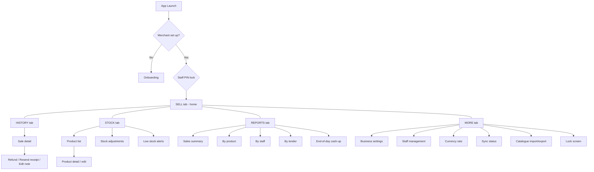
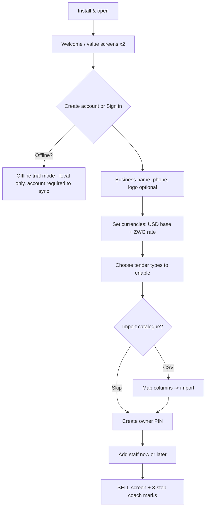
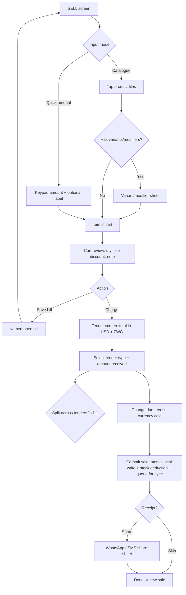
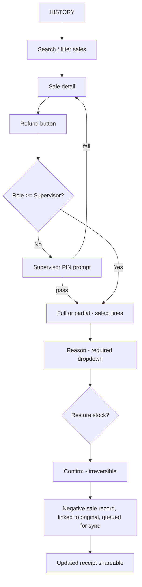
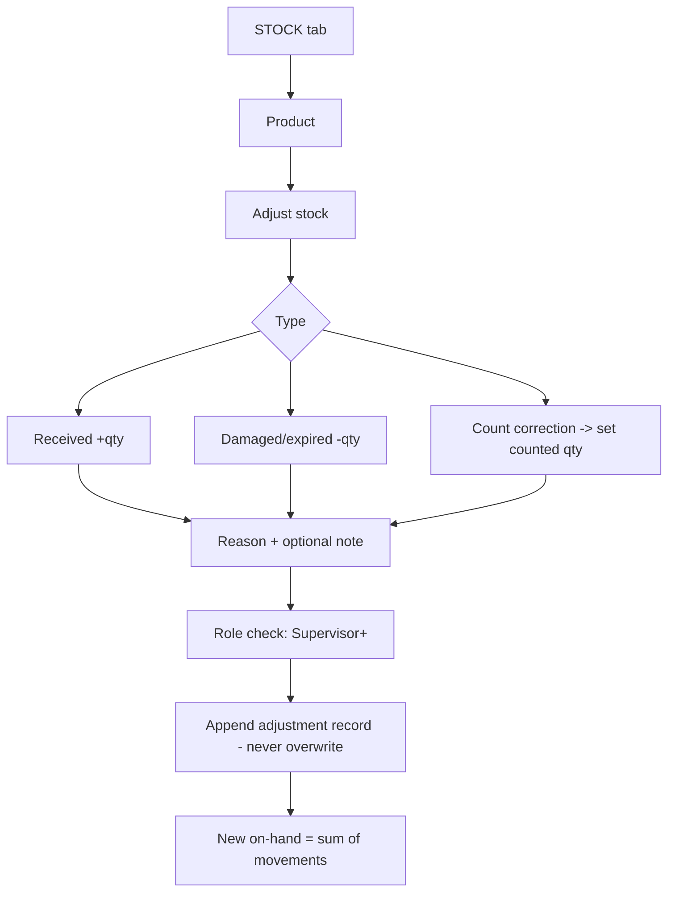
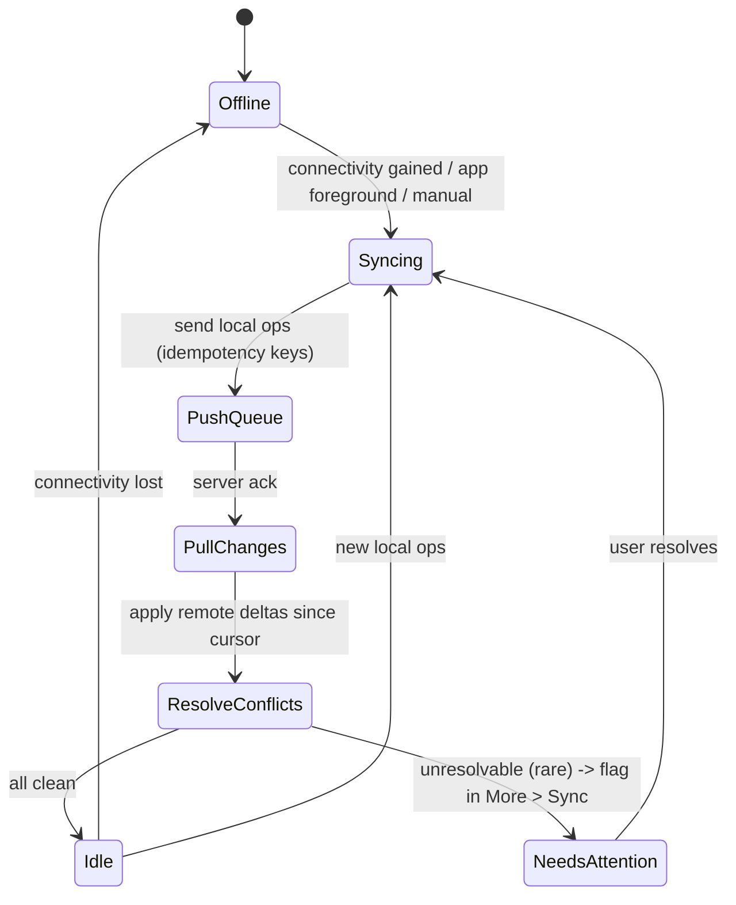
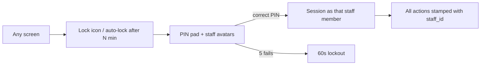
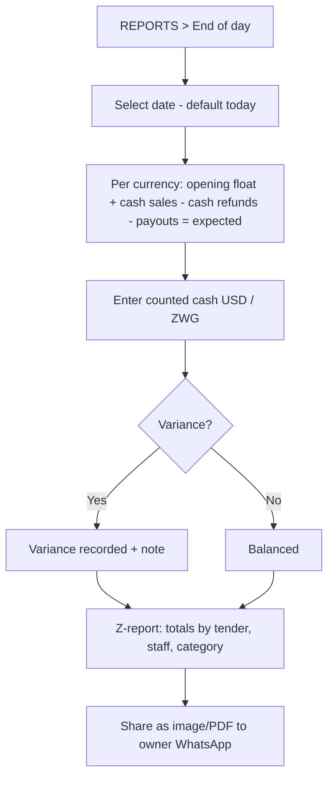

# App Flow Document — Tengesa POS
All diagrams are Mermaid. **Lucidchart imports Mermaid directly** (Insert → Diagram as code → Mermaid), so paste any block below to get an editable chart. They also render on GitHub and in Claude Code.

---

## 1. Navigation map (information architecture)

Yoco pattern: bottom tabs on phone, left rail on tablet. Sell is home.

## 2. First-run onboarding

## 3. Core sale flow (the money path)

## 4. Refund flow

## 5. Stock adjustment flow

## 6. Offline sync state machine

Conflict rules (detail in `04_BACKEND.md`): sales are append-only (no conflicts); product edits = last-write-wins on server receive time; stock = additive movement log (order-independent).

## 7. Staff switch & lock

## 8. End-of-day cash-up

## 9. Screen inventory (build checklist)

Onboarding (4) · PIN lock · Sell · Variant sheet · Cart · Tender · Receipt preview · Open bills · History list · Sale detail · Refund · Stock list · Product edit · Adjustment · Low-stock · Reports home · Report detail ×4 · End-of-day · Settings home · Business settings · Staff list/edit · Currency rate · Sync status · Import/export · About/legal. **≈ 27 screens.**
