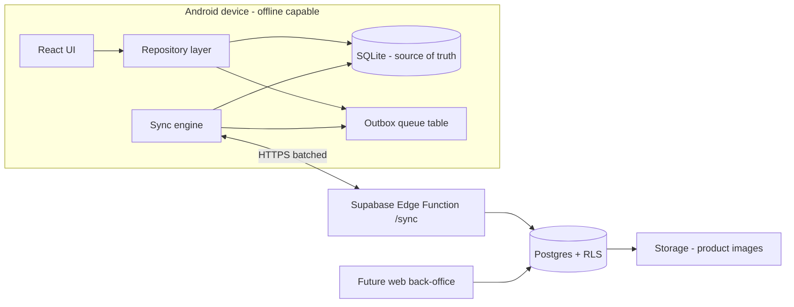

# Backend Document — Tengesa POS

## 1. Tech stack, tools & frameworks

| Layer | Choice | Why (budget + fit) |
|---|---|---|
| App shell | **Capacitor 6 + React 18 + TS + Vite** | Free, MGX already fluent (Shop-Flow/Tengesa), one codebase → Android now, iOS later with zero rewrite |
| Local DB (source of truth) | **SQLite via `@capacitor-community/sqlite`** | True offline-first; SQL matches Supabase schema so sync mapping is 1:1; encrypted storage supported |
| Cloud | **Supabase free tier** (Postgres, Auth, Storage, Edge Functions, Realtime) | Free: 500 MB DB, 50k MAU, 1 GB storage; MGX has live projects & workflow already |
| Auth | Supabase Auth (email/password; Google OAuth for owners) | Free; staff PINs are app-level, not auth users |
| Sync | **Custom lightweight sync engine** (push queue + pull cursor) | PowerSync/ElectricSQL free tiers are limited/complex; our model (append-heavy) suits a simple engine we fully control |
| Images | Supabase Storage, client-side compressed to ≤ 100 KB webp | Stays inside 1 GB free |
| CI/CD | GitHub Actions free tier → signed AAB | Free for public/private small repos |
| Monitoring | Sentry free tier (5k errors/mo) + Supabase logs | Free |
| Dev workflow | Claude Code (architecture/codegen) + SQL direct to Supabase SQL Editor | Existing MGX workflow |

Deliberately avoided: Firebase (vendor lock, Firestore pricing traps at scale), custom Node server (hosting cost + ops burden), Realm/MongoDB (paid sync).

## 2. Architecture



Pattern: **outbox + pull cursor.** Every local mutation writes (a) the domain row and (b) an outbox entry, in one SQLite transaction. The sync engine drains the outbox to a single `/sync` edge function, then pulls server changes newer than its cursor (`last_pulled_at` per table).

## 3. Database schema (identical shape locally and in Postgres)

Conventions: `id` = UUIDv7 (client-generated — critical for offline creates), all money **integer USD cents**, timestamps ISO-8601 UTC, soft deletes via `deleted_at`.

```sql
-- Tenancy
merchants(id, name, phone, logo_url, receipt_footer, created_at)
devices(id, merchant_id, name, platform, last_synced_at)
staff(id, merchant_id, name, pin_hash, role CHECK (role IN ('cashier','supervisor','admin')),
      is_active, created_at, deleted_at)

-- Catalogue
categories(id, merchant_id, name, sort_order, deleted_at)
products(id, merchant_id, category_id, name, image_url, barcode, sku,
         cost_cents, price_cents, track_stock BOOL, low_stock_threshold,
         is_active, updated_at, deleted_at)
product_variants(id, product_id, name, price_delta_cents, sku, deleted_at)
modifiers(id, merchant_id, name, price_cents)          -- v1.1 attach sets

-- Currency
fx_rates(id, merchant_id, rate_zwg_per_usd NUMERIC, effective_from, created_by_staff_id)

-- Selling (append-only)
sales(id, merchant_id, device_id, staff_id, sale_number, status CHECK (status IN
      ('open','completed','refunded','partially_refunded')),
      subtotal_cents, discount_cents, total_cents,
      fx_rate_used NUMERIC, note, completed_at, created_at)
sale_lines(id, sale_id, product_id NULL, variant_id NULL, description,
           qty NUMERIC, unit_price_cents, line_discount_cents, total_cents)
payments(id, sale_id, tender CHECK (tender IN ('cash_usd','cash_zwg','ecocash',
         'zipit','card','other')), amount_cents, amount_zwg NUMERIC NULL,
         change_cents, created_at)
refunds(id, sale_id, staff_id, reason, restock BOOL, total_cents, created_at)
refund_lines(id, refund_id, sale_line_id, qty, amount_cents)

-- Stock (movement log — on-hand is derived, never stored as truth)
stock_movements(id, merchant_id, product_id, variant_id NULL,
    type CHECK (type IN ('opening','sale','refund_restock','received','damaged','count_correction')),
    qty_delta NUMERIC, counted_qty NUMERIC NULL, reason, staff_id, ref_sale_id NULL, created_at)
-- on_hand = SUM(qty_delta); count_correction inserts delta = counted_qty - current_sum

-- Ops
open_bills(id, merchant_id, device_id, name, cart_json, staff_id, updated_at)
cash_ups(id, merchant_id, business_date, currency, opening_float_cents,
         expected_cents, counted_cents, variance_cents, note, staff_id, created_at)
outbox(seq INTEGER PK AUTOINCREMENT, entity, entity_id, op, payload_json,
       idempotency_key UNIQUE, created_at, synced_at NULL)        -- local only
sync_state(table_name PK, last_pulled_at)                          -- local only
audit_log(id, merchant_id, staff_id, action, entity, entity_id, meta_json, created_at)
```

**Postgres extras:** `merchant_id` on every table + RLS: `merchant_id = (select merchant_id from staff_or_owner where auth.uid() ...)` — owner auth user maps to merchant; devices authenticate as the owner's session with a device claim. `sale_number` generated per merchant via sequence table to stay human-readable; provisional local numbers (`TNG-L-xxxx`) are replaced by server numbers on first sync — receipts printed offline carry the provisional number and the UUID.

## 4. Sync protocol

**Push:** `POST /functions/v1/sync/push` with `{device_id, ops: [{idempotency_key, entity, op, payload}]}` (batch ≤ 200). Server upserts inside a transaction, records idempotency keys in `sync_ops_applied` — replays are no-ops (FR-06). Response: per-op ack + server-assigned fields (sale_number).

**Pull:** `POST /functions/v1/sync/pull` with `{cursors: {products: ts, ...}}`. Server returns rows where `updated_at > cursor` (and tombstones via `deleted_at`), capped + paginated. Client applies in FK order: merchants → staff → categories → products → variants → fx_rates → sales → lines → payments → refunds → stock_movements.

**Conflict rules:**
| Entity | Rule |
|---|---|
| Sales, payments, refunds, stock_movements | Append-only → no conflicts by construction |
| Products, categories, settings | Last-write-wins on server `updated_at`; loser kept in `audit_log` |
| Stock on-hand | Never synced as a value — always recomputed from movements (order-independent, mergeable) |
| Open bills | Device-scoped; latest `updated_at` wins |

**Triggers:** connectivity regained (Capacitor Network plugin), app foreground, post-sale (if online, debounced 5s), manual button. Exponential backoff on failure; queue survives restarts.

## 5. API surface

Minimal by design — the app talks to SQLite; only these cloud endpoints exist:

| Endpoint | Type | Purpose |
|---|---|---|
| `/sync/push`, `/sync/pull` | Edge Function | The entire sync protocol |
| Supabase Auth | Built-in | Owner sign-up/in, password reset |
| Storage `product-images/` | Built-in (RLS'd) | Image upload/download |
| `/reports/rollup` (v2) | Edge Function | Pre-aggregated report data for web back-office |
| Realtime on `products` (v2) | Built-in | Live multi-device catalogue updates |

Repository layer interface (the only DB API the UI sees):

```ts
interface SaleRepo {
  createSale(cart: Cart, tender: Tender[], staffId: string): Promise<Sale>; // atomic: sale + lines + payments + stock movements + outbox
  refund(saleId: string, lines: RefundLine[], reason: string, restock: boolean): Promise<Refund>;
  list(filter: SaleFilter): Promise<SaleSummary[]>;
}
interface StockRepo { adjust(...); onHand(productId): Promise<number>; lowStock(): Promise<Product[]>; }
interface SyncEngine { pendingCount(): number; syncNow(): Promise<SyncResult>; status(): SyncStatus; }
```

## 6. Free-tier survival plan

- 500 MB Postgres ≈ years of data for hundreds of small merchants (a sale + 3 lines + payment ≈ 1.5 KB). Monitor via Supabase dashboard monthly; archive job exports sales > 24 months to CSV in Storage.
- Edge Functions 500k invocations/mo: batching keeps a busy merchant to ~50 sync calls/day.
- Auth 50k MAU: owners only (staff are PINs, not users) — effectively unlimited for our scale.
- If the project outgrows free tier: Supabase Pro at $25/mo is the first and only paid step — revenue-gated decision.
